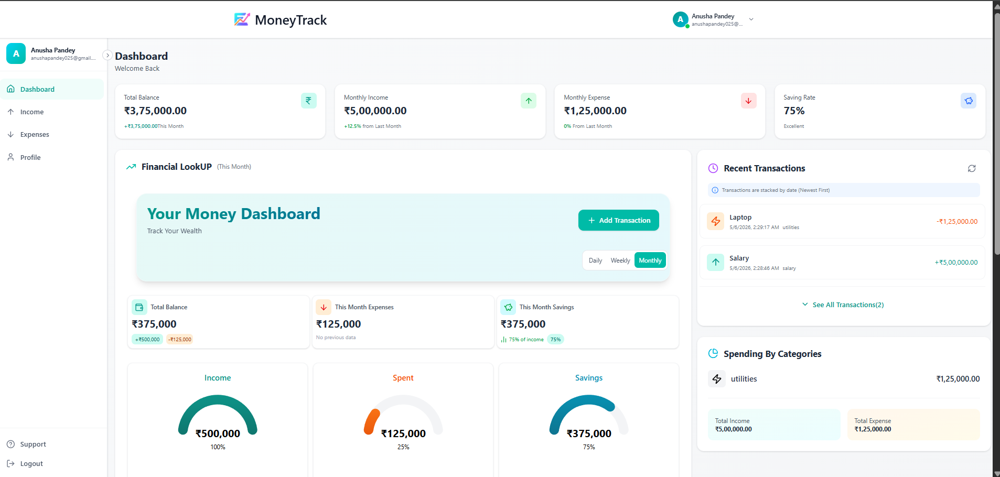
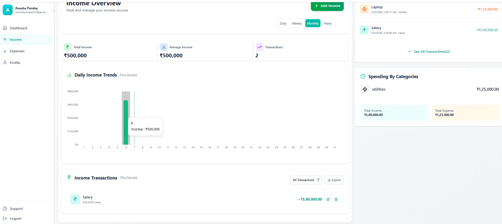
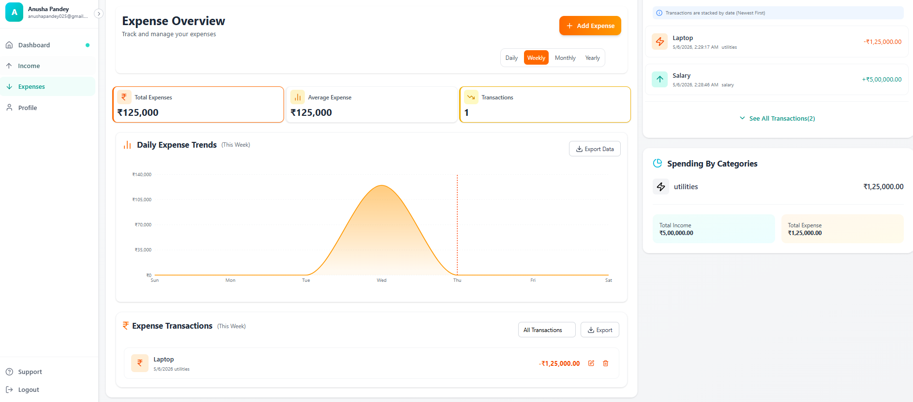
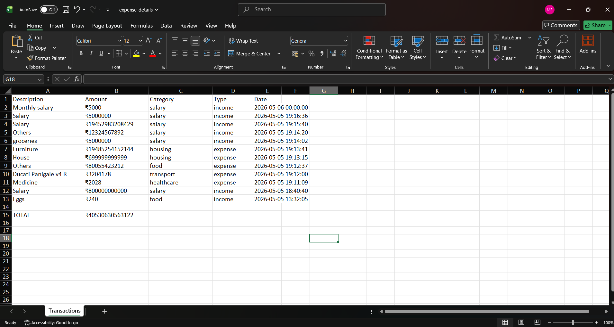
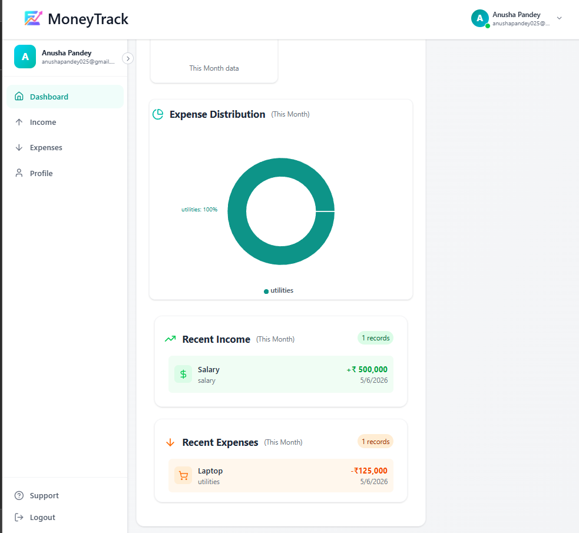
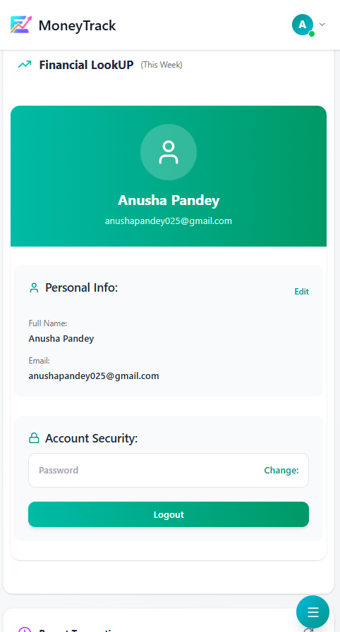

# MoneyTrack — Full Stack Personal Finance Tracker

MoneyTrack is a LOGIC HEAVY full-stack personal finance management platform built to help users track income, expenses, and financial trends through interactive analytics and we can also export our transactions in excel format. I am myself using this project for my personal finance management



The project is fully responsive whether in Tablet View, Phone View and Obviously in Laptop View. It focuses on real-world engineering concepts including authentication systems, REST API architecture, data visualization,data exporting, state management, and production-style debugging workflows.


# Features

# Authentication & Security

1. JWT-based Authentication
2. Protected Routes & APIs
3. User Registration, Login and Logout
4. Profile Management
5. Password Update Support

## Transaction Management

1. Used One Single Transcation Logic instead of separation => Reduced Time Complexity by HALF
2. Add Income Transactions
3. Add Expense Transactions
4. Update Transactions
5. Delete Transactions
6. Category-based Filtering
7. Timeframe-based Tracking
8. Real Time Data Visualization

### Analytics Dashboard

1. Income Overview
2. Expense Overview
3. Financial Trend Visualization
4. Dynamic Chart Rendering
5. Monthly / Weekly / Yearly Analysis

# Preview






#### Data Export

1. Export Transactions to Excel
2. Helps when we want to compare the raw data by using categories

# Preview



##### Frontend Features

1. Responsive UI
2. Interactive Charts using Recharts
3. Toast Notifications
4. Dynamic Filtering
5. Modular Component Architecture
6. Fully RESPONSIVE

# Preview





---

# Tech Stack

## Frontend

1. React.js
2. React Router DOM
3. Axios
4. Tailwind CSS
5. Recharts
6. React Toastify
7. Lucide React
8. XLSX
9. Framer-Motion

## Backend

1. Node.js
2. Express.js
3. MongoDB
4. Mongoose
5. JWT Authentication
6. bcryptjs
7. dotenv
8. Validator
9. body-parser

---

# Project Structure

```bash
MoneyTrack/
│
├── Backend/
│   ├── config/
│   ├── controllers/
│   ├── middleware/
│   ├── models/
│   ├── routes/
│   ├── utils/
│   ├── server.js
│   └── package.json
│
├── Frontend/
│   ├── src/
│   │   ├── components/
│   │   ├── pages/
│   │   ├── assets/
│   │   ├── utils/
│   │   └── App.jsx
│   └── package.json
│
├── .gitignore
└── README.md

---

# Environment Variables (example)

Backend (.env)
PORT=5000
MONGO_URL=your_mongodb_connection_string
JWT_SECRET=your_secret_key
TOKEN_EXPIRY=7d

Frontend (.env)
VITE_API_BASE=http://localhost:5000

---

# Installation & Setup

Clone Repository
git clone <your_repo_url>
cd MoneyTrack

# Backend Setup
cd Backend
npm install
npm run server
# Frontend Setup
cd Frontend
npm install
npm run dev

# API Architecture

## User Routes

/api/user/register
/api/user/login
/api/user/me
/api/user/profile
/api/user/password

## Transaction Routes

/api/transaction/add
/api/transaction/get
/api/transaction/update/:id
/api/transaction/delete/:id
/api/transaction/overview
/api/transaction/downloadexcel

# Engineering Concepts Implemented

1.  REST API Design
2.  JWT Authentication Flow
3.  MongoDB Schema Design
4.  Middleware-based Route Protection
5.  Full CRUD Operations
6.  Reusable React Components
7.  Responsive Data Visualization
8.  Async Request Handling
9.  Environment Variable Management
10. Client-Server Architecture
11. Merging both Expense and Income in one Transactio

# Challenges Faced

 During development, many real-world engineering issues were encountered and resolved:

1. Transaction Logic: First I was making different logics for income and expense, it was too much repetitive code just + and - logic.I fixed by just changing the mongoose Schema by just using type and then enum
2. API route mismatches during frontend/backend integration I was using different server port but it was not that hectic
3. JWT token validation failures: I made tokens for short period of time for more testing so it was always back and forth between Postman and VS Code
4. Recharts responsive rendering issues: Integrating graphs was a mess first of all the pie chart was not rendering at all.I literally forgot that expense Pie Chart will not Reder if I don't write expense but it was fun
5. Environment variable configuration problems: After integrasting .env files this was my first React Integration.It was helpful after trying EJS
5. Protection and Synchronization: Protecting and Synchronising the routes and thinking for different edge cases were the most beautiful and challenging.It took the most amount of time but it was significantly worth it
6. Scalibility: Making this project more scalable was a different Hustle I tried to use as less repetition I can.It's still has many will definitely fix it in coming Days

These debugging experiences significantly improved understanding of full-stack application architecture and production workflows.

# Future Improvements

1.  Docker Containerization
2.  CI/CD Integration using GitHub Actions
3.  Cloud Deployment
4.  Budget Planning System
5.  AI-based Financial Insights
6.  Recurring Transactions
7.  Expense Forecasting
8.  Kubernetes Deployment
9.  Role-based Authorization
10. Financial Health Scoring

## My Take 

I made this project for my personal Finance Tracking to manage my finances.
To maintain my money for college, Deit, Gym and some Gaming 
There are still severel Bugs and Upgrades for example a small improvement like User's name is coming after Welcome Back 
It will give the user a positive vibe and connection with the webpage.
I will be fixing and try to add future Improvements as soon as I can!

## Linkedin (I am new in it!)

LINK: https://www.linkedin.com/in/martand-prakhar-a04904315/

# Author

Martand Prakhar